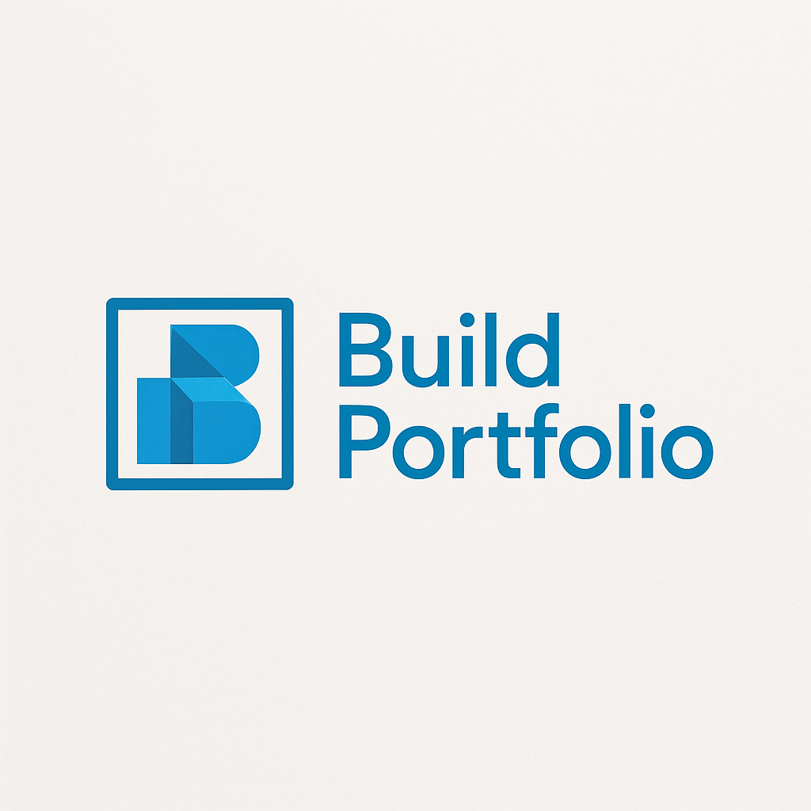
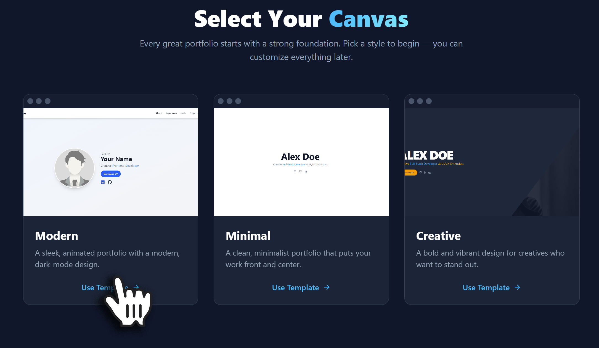
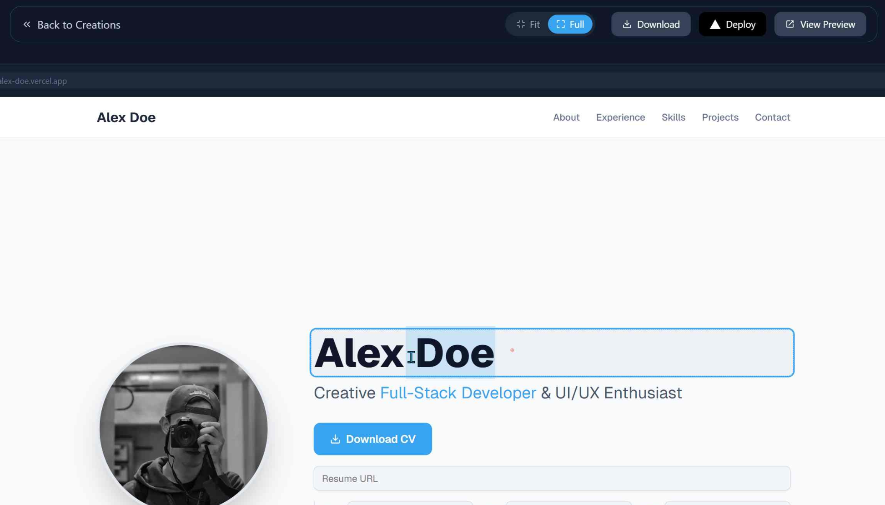
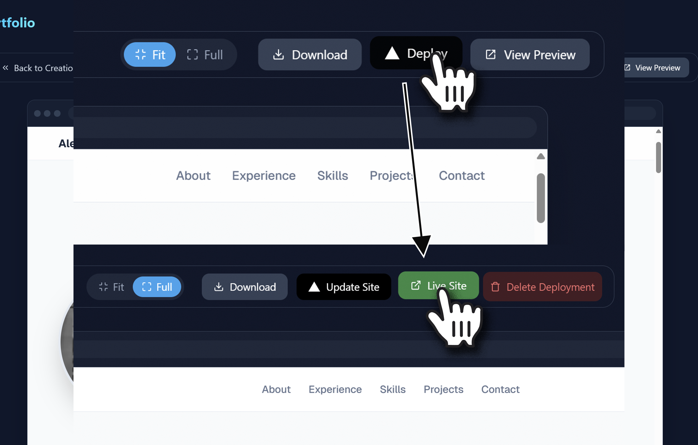

<div align="center">
  
  <h1>✨ NoCodefolio</h1>
  <p>
    The quickest way to build, host, and own a professional developer portfolio.<br />
    <strong>No code, no complexity, no cost.</strong>
  </p>
  <p>
    <a href="https://your-live-app-url.com"><strong>🌐 View Live Demo</strong></a> ·
    <a href="https://github.com/maheshpaulj/NoCodefolio/issues/new?assignees=&labels=bug&template=bug_report.md&title=">🐞 Report Bug</a> ·
    <a href="https://github.com/maheshpaulj/NoCodefolio/issues/new?assignees=&labels=enhancement&template=feature_request.md&title=">🚀 Request Feature</a>
  </p>
</div>

<br />

<p align="center">
  <a href="https://github.com/maheshpaulj/NoCodefolio">
    
  </a>
  <a href="https://github.com/maheshpaulj/NoCodefolio/graphs/contributors">
    
  </a>
  <a href="https://github.com/maheshpaulj/NoCodefolio/stargazers">
    
  </a>
  <a href="https://github.com/maheshpaulj/NoCodefolio/network/members">
    
  </a>
  <a href="https://github.com/maheshpaulj/NoCodefolio/issues">
    
  </a>
</p>

---

## ✨ About The Project

NoCodefolio was born from a simple idea: **creating a professional portfolio shouldn't be a project in itself.** Developers and creatives need a quick, elegant way to showcase their work — no boilerplate code, no expensive subscriptions.

**NoCodefolio** is a no-code portfolio builder that respects your code. It provides:

* ⚡ **A Blazing-Fast Workflow** – From signup to live site in under 5 minutes.
* ✍️ **Live, Visual Editing** – Edit content in real-time with instant previews.
* 🧩 **Full Ownership** – One-click deploy to Vercel or download the full Next.js + Tailwind source code.

> This project is proudly open-source and built for the community.

---

## 🛠️ Built With

* **[Next.js](https://nextjs.org/)** – React Framework for Production
* **[TypeScript](https://www.typescriptlang.org/)** – Typed JavaScript
* **[Tailwind CSS](https://tailwindcss.com/)** – Utility-first CSS
* **[Firebase](https://firebase.google.com/)** – Firestore + Auth
* **[NextAuth.js](https://next-auth.js.org/)** – Secure Authentication
* **[Vercel](https://vercel.com/)** – Hosting & Deployments
* **[Framer Motion](https://www.framer.com/motion/)** – Animations

---

## 🚀 Getting Started

Ready to build and launch your portfolio? Here's how:

### 🧑‍💻 Using the App

1. **Sign In**
   Visit the [live app](https://your-live-app-url.com) and sign in with Google.

2. **Choose a Template**
   Go to the "Generate" page and select a template. 

3. **Customize in the Editor**
   Click "Use Template" to enter the live editor.

   * Inline editing for text/images
   * Edit sections like **Work Experience**, **Skills**, and **Projects**

     

4. **Deploy or Download**

   * 🚀 **Deploy:** Host on Vercel instantly.
   * 📦 **Download:** Get a ZIP of clean Next.js code.

     

---

## 🤝 Contributing

We 💙 contributions! Help improve NoCodefolio by submitting bugs, suggestions, or even templates.

### 📁 Add a New Template

1. **Create an Editable Template Component**

   * Path: `lib/templates/yourTemplate.tsx`
   * Use `ModernTemplateProps` or similar as your interface.
   * Example:

```tsx
export function GalaxyTemplate({ data, isEditable, onUpdate, ...props }: GalaxyTemplateProps) {
  return <div>...your JSX here...</div>;
}
```

2. **Create a Code Generator**

   * Path: `lib/templates/yourGenerator.ts`
   * Export a function returning a map of filenames → content.
   * Example:

```ts
export function galaxyTemplate(data: PortfolioData): Record<string, string> {
  return {
    "app/page.tsx": `...`,
    "package.json": JSON.stringify({ ... }),
  };
}
```

3. **Register the Template**

   * In `app/generate/page.tsx`, add to `availableTemplates`.
   * In `app/api/deploy/route.ts`, map your generator in `generatorMap`.

### 📌 Submit Your PR

1. Fork it 🚀
2. Create your feature branch: `git checkout -b feature/AmazingTemplate`
3. Commit: `git commit -m 'Add: AmazingTemplate'`
4. Push: `git push origin feature/AmazingTemplate`
5. Open a pull request

---

## 📄 License

Distributed under the **MIT License**.
See `LICENSE.md` for more information.

---

## 📬 Contact

Made with ❤️ by:

* **Mahesh Paul**
* **Aryan Sharma**

🔗 Project: [https://github.com/maheshpaulj/NoCodefolio](https://github.com/maheshpaulj/NoCodefolio)
